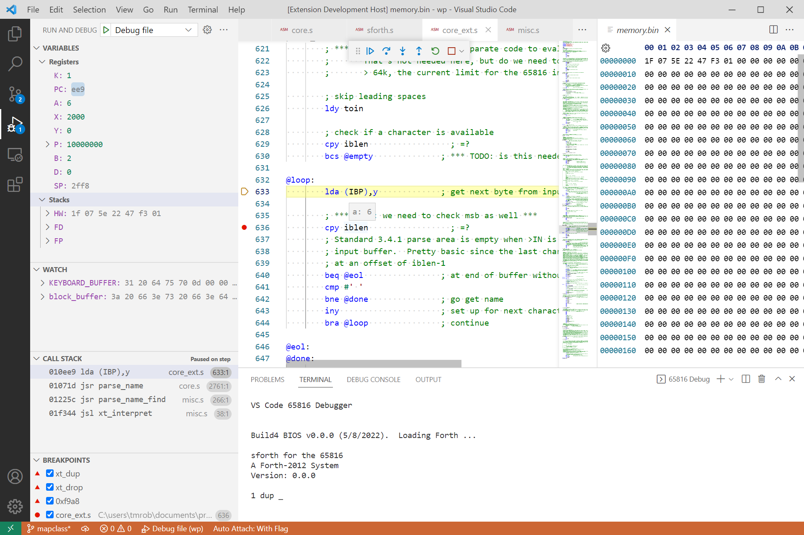

# db65816
VS Code debugger for 65816 assembly code

# Features
* Runs a program from reset vector, optionally stopping on entry
* Supports multi-file programs
* Follow along with execution directly in assembly source files
* Control program execution with continue/pause, single step, step-into, step-over and step-out
* Three types of breakpoints (conditional breakpoints not yet supported):
    * Source: set directly in assembly source files; stops execution when that line is reached
    * Function: set on function name or memory address; stops execution when that function is entered or memory address is reached during program execution
    * Data: set on X, Y, K, B and D register; stops execution when a write access to these registers is made
* Registers and hardware stack displayed in Variables pane and can be modified when program is paused
* Watch pane functional for program symbols and memory addresses (not expressions)
* Variable/watch changes highlighted after each step and on execution pause
* Can drill down on variables/watches that represent a memory range (variable ranges can be opened in a separate hex editor window allowing modification of the memory range)
* Symbol address and value displayed when hovering over a symbol in source code
* Call stack displayed when stepping through program.  Clicking on an entry opens the source code in an editor at that line.  On continue, call stack colapses stack to current instruction.
* Uses integrated terminal window for input/output

# Requirements
db65816 is a VS Code extension (under development) that simulates Western Design Center's [65C816 microprocessor](https://www.wdc65xx.com/wdc/documentation/w65c816s.pdf).  The extension impliments Microsoft's Debug Adapter Protocol to communicate with the VS Code debugging frontend and translates UI commands to control an execution engine simulating the 65C816.  The execution engine "runs" a binary file of the assembled code and can be used independently of the debugging extension.

The extension monitors the execution engine activity and translates it's state into various elements to be displayed in the VS Code UI.  To do so, it uses mapping, listing and symbol files produced during source code assembly.  The extension works with [cc65](https://github.com/cc65/cc65) files to produce an address map between the assembly source files and the assembled binary.  It shouldn't be difficult to modify the extension to create a mapping for other 65C816 assemblers. Unfortunately a disassembly of the binary is not practical.  (The experienced 65C816 user will understand that disassembly of 65816 code is problematic without some constraints set on changing the processor's registers size).

