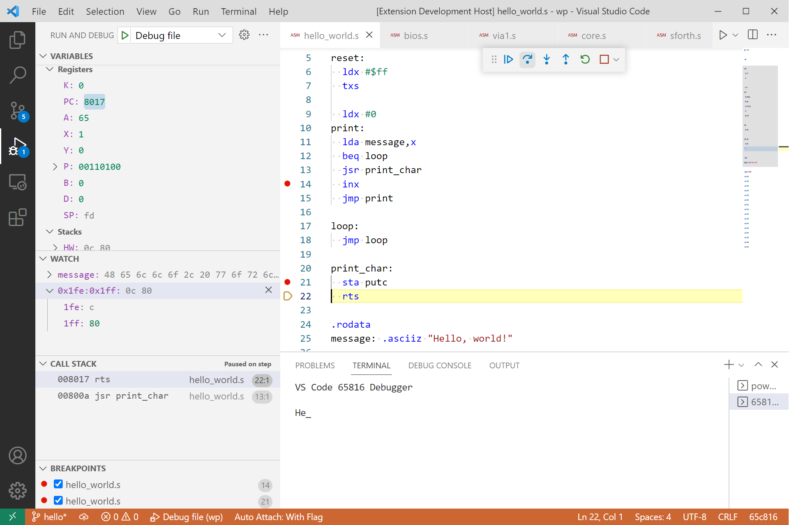

# db65816
VS Code debugger for 65816 assembly code

# Features
* Runs a program from reset vector, optionally stopping on entry
* Supports multi-file programs
* Can set launch arguments for program
* Follow along with execution directly in assembly source files
* Control program execution with continue/pause, single step, step-into, step-over,  step-out and run-to-cursor
* Four types of breakpoints (conditional breakpoints not yet supported):
    * Source: set directly in assembly source files; stops execution when that line is reached
    * Function: set on function name or memory address; stops execution when that function is entered or memory address is reached during program execution
    * Data: set on X, Y, K, B and D register; stops execution when a write access to these registers is made
    * Instruction mnemonic or opcode (opcode allows a break even if there is no supporting source code)
* Registers and hardware stack displayed in Variables pane and can be modified when program is paused
* Watch pane functional for program symbols and memory addresses (not expressions) and the values of these can be changed when the program is paused
* Variable/watch changes highlighted after each step and on execution pause
* Drill down on variables/watches that represent a memory range (variable ranges can be opened in a separate hex editor window allowing modification of the memory range)
* Symbol address and value displayed when hovering over a symbol in source code
* Call stack displayed when stepping through program.  Clicking on an entry opens the source code in an editor at that line.  On continue, call stack collapses stack to current instruction.
* Integrated terminal window for input/output with default read/write addresses at $f004 and $f001 respectively.
* Source files listed in debug pane Loaded Scripts Explorer

# Requirements
db65816 is a VS Code extension (under development) that simulates Western Design Center's [65C816 microprocessor](https://www.wdc65xx.com/wdc/documentation/w65c816s.pdf).  The extension implements Microsoft's Debug Adapter Protocol to communicate with the VS Code debugging frontend and translates UI commands to control an execution engine simulating the 65C816.  The execution engine "runs" a binary file of the assembled code and can be used independently of the debugging extension.

The extension monitors the execution engine activity and translates its state into various elements to be displayed in the VS Code UI.  To do so, it uses mapping, listing and symbol files produced during source code assembly.  The extension works with [cc65](https://github.com/cc65/cc65) files to produce an address map between the assembly source files and the assembled binary.  It assumes file extensions as follows:
* source: `.s`
* listing:  `.lst`
* map:      `.map`
* symbol:   `.sym`

It shouldn't be difficult to modify the extension to create a mapping for other extensions or 65C816 assemblers.

# Debug Adapter and Execution Engine
Class DA65xx in the da65xx.ts module, implements Microsoft's [Debug Adapter Protocol](https://microsoft.github.io/debug-adapter-protocol/) (DAP) to interface between the VS Code debugging UI and the EE65xx execution engine.  The execution engine only knows how to step through a 65xx binary file, simulating its execution. The debug adapter performs all other aspects of debugging from maintaining the current program location in a source file to examining simulated memory to provide the UI with symbol values.  The debug adapter also maintains information on all breakpoints and provides a method that the execution engine calls each step to check if a breakpoint has been hit.

Class EE65xx in the ee65xx.ts module, is a 65xx execution engine with limited debugging support.  It "executes" a 65xx binary instruction by instruction in "steps" and sends events to the debug adapter informing it of certain debugging events.  The debug adapter "follows along" with a CA65 source file (*.s only for now), simulating "running" through the source code line-by-line.  It does this by preparing a mapping of the source code line to binary address using information from the mapping and listing files provided.

EE65xx exposes several methods allowing the debug adapter to control the simulation.  EE65xx supports typical stepping functionality as the core of its "debugging support", but relies exclusively on the debug adapter for other debugging activities, such as maintaining breakpoints and variable requests.  To check if a breakpoint has been hit for example, the execution engine checks with the debug adapter each step.  EE65xx is completely independent from VS Code and the Debug Adapter and can be run as a standalone simulator without debugging.

The core of the execution engine is a Typescript port of the core of my [py65816](https://github.com/tmr4/py65816) Python simulator package.  The Python version has been tested with unit tests covering about 98% of the code (see the link for limitations).  Similar tests have not been made on the Typescript core but it has successfully passed a significant set of higher-level functional tests.  I don't plan on porting the Python unit tests as it's code base is significantly larger than just the core alone.  As always, use at your own risk.

# Installation
Clone this repository and open it in VS Code.  Open a terminal and type `install npm`.  You should be ready to run the hello world example.

# Hello World Example
I've included a very simple "hello world" example project in the [wp](wp/hello_world.s) folder.  To run it, open the debug adapter extension project in VS Code and press F5 to start debugging.  VS Code will open a new window where you can run the hello world example.  Open hello_world.s, make sure "Debug File" is selected in the VS Code debug pane and press F5.  The program should pause at the start of the reset subroutine.

# Use
The db65816 extension implements many of VS Code's debugging capabilities.  See [Debugging](https://code.visualstudio.com/docs/editor/debugging) for an overview of using the VS Code debugging interface.  In some cases, db65816 behaves slightly differently than standard:
* In addition to named function breakpoints, you can add an address as a function breakpoint.  This is especially useful to set a breakpoint at a location where a source file isn't available.  The address can be entered as either a decimal or hex value (enter hex with a 0x prefix).
* Data breakpoints can only be set on the X, Y, K, B and D registers and only for write access.  Execution will break at an instruction that will write to one of these registers.  Note that unlike a normal data breakpoint, db65816 breaks at the instruction regardless if the value in the register will actually change.
* I use VS Code's exception breakpoint functionality to implement instruction mnemonic and opcode breakpoints.  You can add multiple instructions or opcodes separated by commas.  Currently, instruction entries are case sensitive and compared to the actual source code, so CLC and clc are two distinctive instructions.  In addition, you can break on macros by entering the macro name as an instruction breakpoint.
* Watches can be set for symbols that are in the symbol file.  The value of watched symbols can be changed via the `Set Value` context menu item.  Watches can also be set for memory by address.  Enter the address either in decimal or hex (enter hex with a 0x prefix).  Memory ranges can also be watched.  Enter a memory range as the starting and ending address separated with a colon, such as start:end.  Memory ranges can be drilled down and individual address values changed with the `Set Value` menu item.
* Make sure to check the context menu in each area of the debugger to see what options are available.  This is the only way to access many functions.

# Status and Limitations
1. This is a work in progress and will likely remain so.  I make no claims to its usability or suitability for your uses.  Coding is just a hobby for me, so take care.  Much of the code hasn't been rigorously tested, is without error checking and likely is inefficient.  Still, hopefully it will help others get past the limited documentation regarding VS Code's implementation of Microsoft's DAP.  Another good starting point is Microsoft's [Mock-Debug](https://github.com/Microsoft/vscode-mock-debug) which was the starting point for this project.
2. The installation steps noted above are all you should need to do if your system is set up like mine.  There may be other setup steps you need to take if you don't have all of the prerequisite software installed already.
3. RESOLVED (10/24/2022): This seems to have resolved itself as I updated the repository.  Downloading the zipped repository no longer receives a warning.  ORIGINAL ISSUE: I got a Windows Defender warning of a Wacatac Trogen when downloading the zipped repository from GitHub.  My local repository and zips of them scan clean so this is likely a false positive.  However, if you are concerned, don't download or clone the repository.  It will be interesting to see if this continues as I update the repository.
4. more to come...

